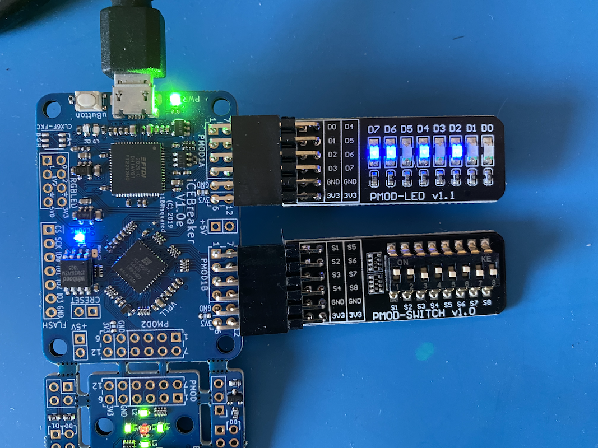

# Step 3 - Read From Switches PMOD and Write to LEDs PMOD

Working with PMOD expansion ports.

- [PMOD-LED](https://www.aliexpress.com/item/1005002988166709.html) expansion board
- [PMOD-SWITCH](https://www.aliexpress.com/item/1005002988228196.html) expansion board

Activating a switch will activate the corresponding LED,

Build and program ICEBreaker FPGA with makefile:

```bash
$ make program-fpga
```



